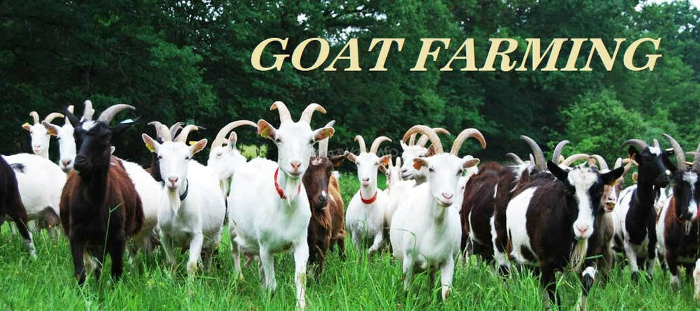

Welcome to the **Goat Farming Web App** documentation! This comprehensive guide will walk you through all the features, tools, and guides offered by our platform to help you get started with sustainable goat farming.

---

## What is Goat Farming Web App?

The **Goat Farming Web App** is a powerful tool designed to support farmers, beginners, and agricultural enthusiasts in managing and improving their goat farming operations. From choosing the right breed to maximizing profitability, our platform provides everything you need to run a successful, healthy, and sustainable goat farm.

Whether you're just getting started or looking to scale your farm, this app delivers expert knowledge, step-by-step guides, and practical tools that help make goat farming easy and efficient.

## Overview of Our Documentation

This documentation is your go-to resource for understanding the various features of our platform and learning best practices in goat farming. Below is an overview of the sections to help you get the most out of our app.

### 1. Getting Started
   - **Introduction to Goat Farming**: Learn the basics of goat farming, its benefits, and what it takes to get started.
   - **Setting Up Your Farm**: Step-by-step guidance on setting up your goat farm, choosing the right breed, and building infrastructure.
   - **Farm Management Tools**: Explore the tools our app provides to manage your daily farming tasks.

   <!-- 📄 [Read the Getting Started Guide](./getting-started.md) -->

### 2. Healthy Goat Care
   - **Feeding & Nutrition**: Learn about the proper diet and feeding schedules to ensure a healthy goat herd.
   - **Health Management**: Get tips on preventing diseases, vaccinations, and caring for pregnant goats.
   - **Common Diseases & Treatment**: A guide to recognizing and treating common goat diseases.

   <!-- 📄 [Explore Goat Care](./goat-care.md) -->

### 3. Sustainable Farming Practices
   - **Rotational Grazing**: Learn how to manage pastures effectively and sustainably.
   - **Organic Farming**: Find out how to run an organic goat farm, reducing chemical inputs and improving farm sustainability.
   - **Water & Waste Management**: Tips on conserving water and properly managing farm waste.

   <!-- 📄 [Read Sustainable Farming Tips](./sustainable-farming.md) -->

### 4. Maximizing Farm Profitability
   - **Breeding & Genetics**: Understand breeding strategies to improve herd productivity and profitability.
   - **Marketing & Sales**: Learn how to sell goat products (milk, meat, fiber) and maximize farm revenue.
   - **Financial Planning**: Manage your farm's financial health with budgeting tools and profitability calculators.

   <!-- 📄 [Learn More About Profitability](./profitability.md) -->

### 5. Advanced Tools & Features
   - **Farm Automation**: Explore automation tools like feeding schedules, milking systems, and monitoring herd health using IoT devices.
   - **Advanced Goat Breeding**: Dive deep into genetics and herd management.
   - **Farm Expansion Strategies**: Get expert tips on how to scale your farm.

   <!-- 📄 [Advanced Tools for Your Farm](./advanced-features.md) -->

## Key Features of the Goat Farming Web App

### 🐐 Breed Selection Guide 🌿 
Easily choose the best goat breeds for your farm, based on climate, purpose (meat, milk, fiber), and your farm’s size.

### 🏡 Farm Layout & Infrastructure Planner
Plan your farm’s layout, including goat shelters, grazing areas, and water systems, ensuring maximum efficiency and comfort for your goats.

### 🍃 Sustainable Farming Dashboard
Track your farm’s sustainability score and get suggestions on how to reduce your environmental impact.

### 📊 Profitability Calculator
Maximize profits by calculating the potential income from selling goat products (milk, meat, fiber) and reducing operational costs.

### 📅 Farm Management Tools
Automate feeding schedules, health checks, breeding cycles, and more to streamline your daily operations.

## How to Navigate Our Documentation

Each section in this documentation is carefully designed to help you use our app more effectively and learn the best practices for goat farming. Here's how to navigate:

- Use the **Table of Contents** on the left to explore different sections.
- Follow the **links** within each section to dive deeper into specific topics.
- Utilize the **search bar** at the top to quickly find guides, tutorials, and reference materials.

## Getting Support

If you need further assistance or have any questions while using the Goat Farming Web App, feel free to:

- **Join Our Community Forum**: Connect with other goat farmers and share experiences.
- **Read Our FAQs**: Find answers to common questions.
- **Contact Our Support Team**: Reach out to our team for personalized help.

📧 [Contact Support](mailto:codeharborhub@gmail.com)

## Learn & Grow with Goat Farming Web App

Start your goat farming journey today with the Goat Farming Web App, where you can learn sustainable practices, grow your herd, and run a successful farm. 

<!-- 📄 [Explore the Full Documentation](./docs/overview.md) -->