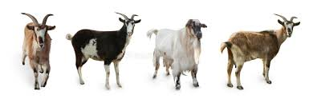

<!--  -->

Welcome to the fascinating world of **Goat Farming History**! Goats have been an integral part of human civilization for thousands of years, providing milk, meat, fiber, and companionship to farmers and communities around the world. In this guide, we'll explore the origins of goat farming, its evolution through ancient civilizations, and the modern practices and technologies that have transformed the industry.

## Origins of Goat Farming