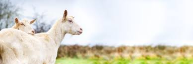

Welcome to the world of **Goat Farming**, a sustainable, profitable, and rewarding agricultural practice. Whether you're looking to raise goats for dairy, meat, fiber, or as part of a sustainable farming initiative, this guide will help you get started with the right knowledge and tools.

This overview covers everything you need to know as a beginner in goat farming, including the types of farming, the benefits of goat farming, and the initial steps to setting up your own farm.

## What is Goat Farming?

Goat farming involves the raising and breeding of domestic goats for various purposes, including:

- **Milk production**
- **Meat production**
- **Fiber production** (such as cashmere or mohair)
- **As pets or for organic land management**

### Why Goat Farming?

Goat farming offers a range of advantages, making it a popular choice for both small-scale farmers and larger agricultural businesses:

1. **Low Investment**: Compared to other livestock, goats require less investment in terms of infrastructure and feed.
2. **High Return**: Goats are highly productive animals, and their products (milk, meat, and fiber) have high market value.
3. **Sustainable Agriculture**: Goats can adapt to various environments and feed on a wide range of vegetation, making them ideal for eco-friendly farming.
4. **Multipurpose Animals**: Goats provide multiple products (milk, meat, fiber, and manure) which can diversify your income streams.

## Types of Goat Farming

There are several types of goat farming, each with its own focus and business potential. Depending on your goals, you can choose one or combine multiple types:

### 1. **Dairy Farming**
   - **Focus**: Raising goats for milk production.
   - **Popular Breeds**: Saanen, Alpine, Nubian.
   - **Products**: Goat milk, cheese, yogurt, butter.
   - **Why It’s Profitable**: Goat milk is highly nutritious and often sought after by health-conscious consumers.

### 2. **Meat Farming**
   - **Focus**: Raising goats for meat production (chevon).
   - **Popular Breeds**: Boer, Kiko, Spanish goats.
   - **Products**: Goat meat (a lean, nutritious protein).
   - **Why It’s Profitable**: Goat meat is in high demand in many parts of the world and is considered a healthy alternative to other meats.

### 3. **Fiber Farming**
   - **Focus**: Raising goats for their fiber (wool).
   - **Popular Breeds**: Angora (for mohair), Cashmere goats.
   - **Products**: Fine fiber used in the textile industry.
   - **Why It’s Profitable**: Cashmere and mohair are luxury fibers with high market demand, especially in the fashion industry.

### 4. **Mixed Farming**
   - **Focus**: Raising goats for multiple purposes (milk, meat, fiber).
   - **Why It’s Profitable**: Diversifying your farm’s income by producing multiple products reduces risk and increases profitability.

---

## The Benefits of Goat Farming

### 1. **Profitability**
Goats are easy to raise and have a short reproductive cycle, which means you can quickly build a sizable herd. Their milk, meat, and fiber fetch premium prices, especially in organic and niche markets.

### 2. **Sustainability**
Goats are known as “browsers,” meaning they feed on a wide range of plants, including weeds and shrubs. This makes them excellent for sustainable land management and reduces the need for high-quality feed.

### 3. **Adaptability**
Goats can thrive in different climates and environments, from arid regions to lush green pastures. This adaptability makes them ideal for small-scale farmers in diverse geographic locations.

### 4. **Low Maintenance**
Compared to other livestock, goats are relatively low-maintenance. They require less space, feed, and care, making them a cost-effective option for new farmers.

---

## How to Get Started

Starting a goat farm requires careful planning and consideration. Here’s an overview of the steps to take:

### 1. **Choosing the Right Breed**
Each goat breed has its own strengths depending on whether you want to produce milk, meat, or fiber. Research and select a breed that aligns with your farming goals.

### 2. **Setting Up the Farm**
You will need a well-ventilated shelter, proper fencing, and enough pasture for grazing. Goats are agile and can escape poorly built fences, so invest in high-quality infrastructure.

### 3. **Feeding & Nutrition**
Goats need a balanced diet that includes hay, grains, minerals, and fresh water. Depending on your location, you can supplement their diet with pasture grazing or browse.

### 4. **Goat Health Care**
Preventing diseases through proper vaccination, regular deworming, and a clean living environment is crucial to maintaining a healthy herd. Learn the common health issues and how to address them.

---

## Conclusion

Goat farming offers a path to profitable and sustainable farming. Whether you’re interested in dairy, meat, or fiber production, goats provide a low-cost and high-yield farming opportunity. This beginner’s guide serves as an introduction to the essentials of goat farming, and as you proceed through this guide, you will gain deeper insights and practical tips to succeed in the field.

Explore the rest of this guide to learn more about setting up your farm, choosing the right breeds, and ensuring a healthy and productive herd.