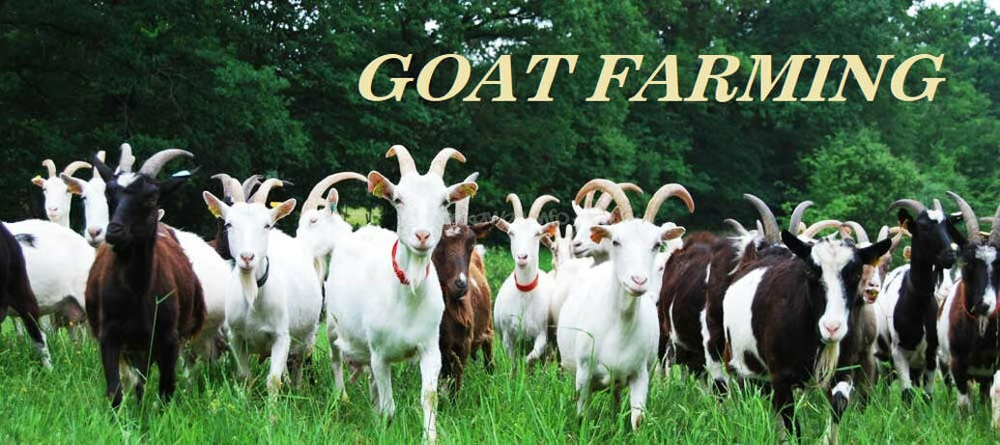

**बकरी पालन वेब ऐप** दस्तावेज़ीकरण में आपका स्वागत है! यह गाइड आपको हमारी प्लेटफ़ॉर्म द्वारा प्रदान की जाने वाली सभी सुविधाओं, उपकरणों और निर्देशों के बारे में बताएगा, ताकि आप टिकाऊ बकरी पालन की शुरुआत कर सकें।

---

## बकरी पालन वेब ऐप क्या है?

**बकरी पालन वेब ऐप** एक शक्तिशाली उपकरण है जो किसानों, शुरुआती और कृषि के शौकीनों की मदद के लिए बनाया गया है। यह ऐप बकरी पालन को अधिक लाभदायक और स्वस्थ बनाने में मदद करता है। सही नस्ल चुनने से लेकर लाभ को अधिकतम करने तक, हमारी प्लेटफ़ॉर्म वह सब कुछ प्रदान करती है जिसकी आपको एक सफल, स्वस्थ और टिकाऊ बकरी फार्म चलाने के लिए आवश्यकता होती है।

चाहे आप शुरुआत कर रहे हों या अपने फार्म को बढ़ाने की योजना बना रहे हों, यह ऐप विशेषज्ञ जानकारी, चरण-दर-चरण गाइड और व्यावहारिक उपकरण प्रदान करता है, जिससे बकरी पालन आसान और प्रभावी बनता है।

## दस्तावेज़ीकरण का अवलोकन

यह दस्तावेज़ीकरण आपके लिए हमारी प्लेटफ़ॉर्म की विभिन्न सुविधाओं को समझने और बकरी पालन में सर्वश्रेष्ठ प्रथाओं को सीखने के लिए एक उपयोगी संसाधन है। यहाँ विभिन्न अनुभागों का अवलोकन दिया गया है जो आपको ऐप का अधिकतम लाभ उठाने में मदद करेंगे।

### 1. शुरुआत करना
   - **बकरी पालन का परिचय**: बकरी पालन के बुनियादी सिद्धांतों, इसके लाभों और शुरुआत कैसे करें, के बारे में जानें।
   - **आपका फार्म सेट करना**: बकरी फार्म सेटअप, सही नस्ल का चयन और ढांचे के निर्माण पर चरण-दर-चरण मार्गदर्शन।
   - **फार्म प्रबंधन उपकरण**: दैनिक कार्यों के प्रबंधन के लिए ऐप द्वारा प्रदान किए जाने वाले उपकरणों का अन्वेषण करें।

   <!-- 📄 [शुरुआत गाइड पढ़ें](./getting-started.md) -->

### 2. स्वस्थ बकरी देखभाल
   - **खान-पान और पोषण**: स्वस्थ बकरी झुंड के लिए उचित आहार और भोजन शेड्यूल के बारे में जानें।
   - **स्वास्थ्य प्रबंधन**: बीमारियों से बचाव, टीकाकरण और गर्भवती बकरियों की देखभाल के बारे में टिप्स प्राप्त करें।
   - **आम बीमारियां और उपचार**: आम बकरी बीमारियों को पहचानने और उनका उपचार करने के लिए एक गाइड।

   <!-- 📄 [बकरी देखभाल का अन्वेषण करें](./goat-care.md) -->

### 3. टिकाऊ खेती के अभ्यास
   - **रोटेशनल चराई**: चरागाहों का प्रभावी और टिकाऊ तरीके से प्रबंधन कैसे करें, जानें।
   - **जैविक खेती**: रसायनों का उपयोग कम करके और फार्म की स्थिरता में सुधार करके जैविक बकरी फार्म कैसे चलाएं, जानें।
   - **जल और अपशिष्ट प्रबंधन**: जल संरक्षण और फार्म अपशिष्ट प्रबंधन के लिए सुझाव।

   <!-- 📄 [टिकाऊ खेती के सुझाव पढ़ें](./sustainable-farming.md) -->

### 4. फार्म लाभप्रदता को अधिकतम करना
   - **प्रजनन और आनुवंशिकी**: झुंड की उत्पादकता और लाभप्रदता बढ़ाने के लिए प्रजनन रणनीतियों को समझें।
   - **मार्केटिंग और बिक्री**: बकरी उत्पादों (दूध, मांस, फाइबर) को बेचने और फार्म की आय को अधिकतम करने के तरीके जानें।
   - **वित्तीय योजना**: बजटिंग उपकरण और लाभप्रदता कैलकुलेटर के साथ अपने फार्म की वित्तीय स्थिति का प्रबंधन करें।

   <!-- 📄 [लाभप्रदता के बारे में और जानें](./profitability.md) -->

### 5. उन्नत उपकरण और सुविधाएँ
   - **फार्म ऑटोमेशन**: IoT उपकरणों का उपयोग करके भोजन शेड्यूल, दूध प्रणाली और झुंड स्वास्थ्य की निगरानी जैसे स्वचालन उपकरणों का अन्वेषण करें।
   - **उन्नत बकरी प्रजनन**: आनुवंशिकी और झुंड प्रबंधन पर गहराई से जाएं।
   - **फार्म विस्तार रणनीतियाँ**: अपने फार्म को बढ़ाने के लिए विशेषज्ञ सुझाव प्राप्त करें।

   <!-- 📄 [आपके फार्म के लिए उन्नत उपकरण](./advanced-features.md) -->

## बकरी पालन वेब ऐप की प्रमुख विशेषताएँ

### 🐐 नस्ल चयन गाइड 🌿 
आपके फार्म के आकार, जलवायु और उद्देश्य (मांस, दूध, फाइबर) के अनुसार सबसे अच्छी बकरी नस्लें आसानी से चुनें।

### 🏡 फार्म लेआउट और ढांचा योजनाकार
अपने फार्म का लेआउट बनाएं, जिसमें बकरी आश्रय, चराई क्षेत्र और जल प्रणाली शामिल हैं, ताकि आपकी बकरियों के लिए अधिकतम आराम और दक्षता सुनिश्चित हो सके।

### 🍃 टिकाऊ खेती डैशबोर्ड
अपने फार्म की स्थिरता स्कोर को ट्रैक करें और पर्यावरणीय प्रभाव को कम करने के सुझाव प्राप्त करें।

### 📊 लाभप्रदता कैलकुलेटर
बकरी उत्पादों (दूध, मांस, फाइबर) को बेचने और संचालन लागत को कम करके लाभ को अधिकतम करें।

### 📅 फार्म प्रबंधन उपकरण
दैनिक कार्यों को सुव्यवस्थित करने के लिए भोजन शेड्यूल, स्वास्थ्य जांच, प्रजनन चक्र और अन्य को स्वचालित करें।

## हमारे दस्तावेज़ीकरण को कैसे नेविगेट करें

इस दस्तावेज़ीकरण का प्रत्येक अनुभाग आपको हमारे ऐप का प्रभावी ढंग से उपयोग करने और बकरी पालन की सर्वोत्तम प्रथाओं को सीखने में मदद करने के लिए सावधानीपूर्वक डिज़ाइन किया गया है। यहाँ नेविगेट करने का तरीका बताया गया है:

- बाईं ओर **सामग्री तालिका** का उपयोग करके विभिन्न अनुभागों का अन्वेषण करें।
- विशिष्ट विषयों में गहराई से जाने के लिए प्रत्येक अनुभाग के भीतर **लिंक्स** का पालन करें।
- गाइड, ट्यूटोरियल और संदर्भ सामग्री को जल्दी से खोजने के लिए शीर्ष पर **खोज बार** का उपयोग करें।

## समर्थन प्राप्त करें

यदि आपको बकरी पालन वेब ऐप का उपयोग करते समय और सहायता की आवश्यकता हो या आपके पास कोई प्रश्न हो, तो बेझिझक संपर्क करें:

- **हमारे सामुदायिक फोरम में शामिल हों**: अन्य बकरी किसानों से जुड़ें और अनुभव साझा करें।
- **हमारे सामान्य प्रश्न पढ़ें**: सामान्य प्रश्नों के उत्तर पाएं।
- **हमारी समर्थन टीम से संपर्क करें**: व्यक्तिगत मदद

के लिए हमारी टीम से संपर्क करें।

📧 [Contact Support](mailto:codeharborhub@gmail.com)

## बकरी पालन वेब ऐप के साथ सीखें और आगे बढ़ें

आज ही बकरी पालन वेब ऐप के साथ अपनी बकरी पालन यात्रा शुरू करें, जहां आप टिकाऊ प्रथाओं को सीख सकते हैं, अपने झुंड को बढ़ा सकते हैं और एक सफल फार्म चला सकते हैं।

<!-- 📄 [पूर्ण दस्तावेज़ीकरण का अन्वेषण करें](./docs/overview.md) -->