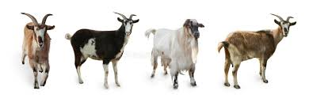

<!--  -->

**बकरी पालन के इतिहास** की इस आकर्षक दुनिया में आपका स्वागत है! बकरियां हजारों वर्षों से मानव सभ्यता का अभिन्न हिस्सा रही हैं, जो दुनिया भर के किसानों और समुदायों को दूध, मांस, फाइबर और साथ देती रही हैं। इस गाइड में, हम बकरी पालन की उत्पत्ति, प्राचीन सभ्यताओं के दौरान इसका विकास, और उन आधुनिक प्रथाओं और तकनीकों का अन्वेषण करेंगे जिन्होंने इस उद्योग को बदल दिया है।

## बकरी पालन की उत्पत्ति
